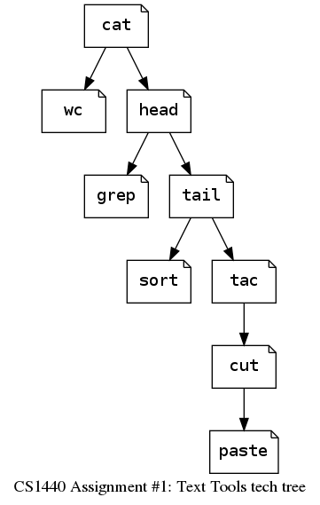

# Assignment 1 Hints


## Look for Analogies

*   Each text tool shares the same structure: `Input -> Process -> Output`
*   Once you've written the first tool the rest are a variation on this theme. 
*   I suggest that you implement the tools in this order, beginning with `cat`:




## Start with implementing the default behaviors

*   Don't worry about supporting optional command-line arguments until you have a tool's default behavior working right


## Segregate responsibilities

*   I've started you off with modules that keep related code together; embrace this organization and don't fight it
*   Decide which actions should happen in the driver program and which actions should occur in the module code
    *   Handle errors as soon as you can reasonably detect them, but do not go out of your way to detect them earlier than necessary; find a balance
    *   Don't open files too early in your program
    *   Don't wait too long to inspect the argument list


## Did you study the [examples](examples)?

*   Before you ask me or the TAs what your program should output in a given situation, look for an answer in the examples


## Python's list collection is your friend

*   Remember that files can be treated as lists of strings
*   Many of these text tools use a list or two at their heart
*   You job is made easier when you use methods of the `str` class which convert strings to/from lists


## Close files when you are done with them

*   For every call to `open()` you should have a corresponding call to `close()`
*   When you let `open()` throw an error which causes your program to exit ,
    Python will call `close()` for you


## Values in `sys.argv` are always strings

*   When your program must interpret an argument from `sys.argv` as a number, remember that you must convert it to a number yourself
*   Use `int()` instead of `eval()` to convert strings into numbers
    *   While `eval()` is very convenient it suffers from the major drawback of executing *anything* the user enters as a Python statement; this is a dangerous ability to entrust to your user


## Use `sys.exit()` to terminate your program immediately

*   When your program detects a serious error and cannot proceed, call `sys.exit()` with a non-zero integer parameter to indicate that your program has terminated unsuccessfully
*   Where required, do this in conjunction with calling `usage()` to report the problem to the user

    ```
    usage(error="Unrecognized argument", tool="grep")
    sys.exit(2)
    ```


## Efficiency matters, but only if your code works at all

*   Focus on getting your code to work before worrying about speed
    *   Remember that you're graded on functionality, not performance
*   In general, try to process input files one line at a time instead of copying their entire contents into memory at once
    *   Some tools, however, can only work if the entire file is in memory; use your best judgement


## Cite external sources in your repository's `README.md`.
