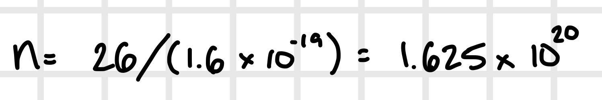
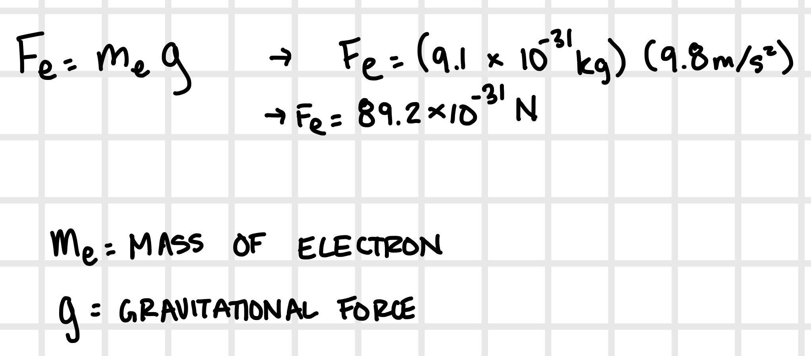
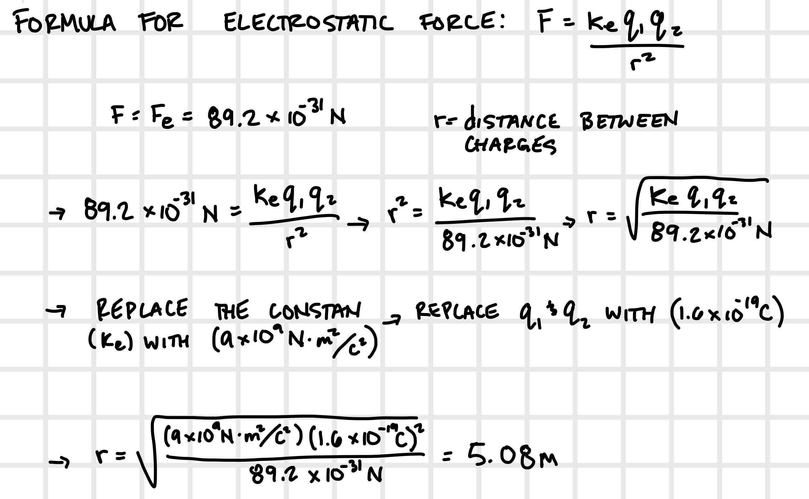

## Homework 1 (Chapter 20)

### Exercise 20.14

#### Question
A typical lightning flash delivers about 26 C of negative charge from cloud to ground.

How many electrons are involved?

#### General Steps

You can calculate the total number of electrons by dividing the total negative charge delivered by the charge of an electron.

*Reminder:*

Charge of electron = 1.6 * 10^-19

#### Answer

### Exercise 20.19

#### Question

An electron at Earth's surface experiences a gravitational force *m_e* * *g*

How far away can a proton be and still produce the same force on the electron? (Your answer should show why gravity is unimportant on the molecular scale!)

#### General Steps

* Calculate the gravitational force that acts on an electron
* Compute the electrostatic force between an electron and proton (using Coulomb's law) and consider the gravitational force to compute the expression for separation between the electron and proton.
* Substitute the appropriate values into the expression to find the separation between the electron and proton

*Reminder:*

Coulomb's Law: Electrostatic force between any two charges is directly proportional to the product of the charges and inversely proportional to the square of the distance between them.

Gravitational force: 9.8m/s^2

Mass of electron: 9.1 * 10^-31kg

Coulomb's constant value for charged objects immersed by air: 9.0 * 10^9 N * m^2 /C^2

#### Answer

Pt 1: Gravitational force that acts on an Electron:

Pt 2 + Pt 3: Expression for separation & Solving

### * Exercise 20.22

#### Question

A proton is at the origin and an electron is at the point x = 0.37 nm , y = 0.30 nm .

Find the electric force on the proton.

#### General Steps

### Exercise 20.23

### Exercise 20.28

### Exercise 20.29

### Exercise 20.34

### * Exercise 20.35

### Exercise 20.44

### Exercise 20.49

### Exercise 21.17

### Exercise 21.19

### * Exercise 21.21

### Exercise 21.22

### Exercise 21.17

### Exercise 21.31
