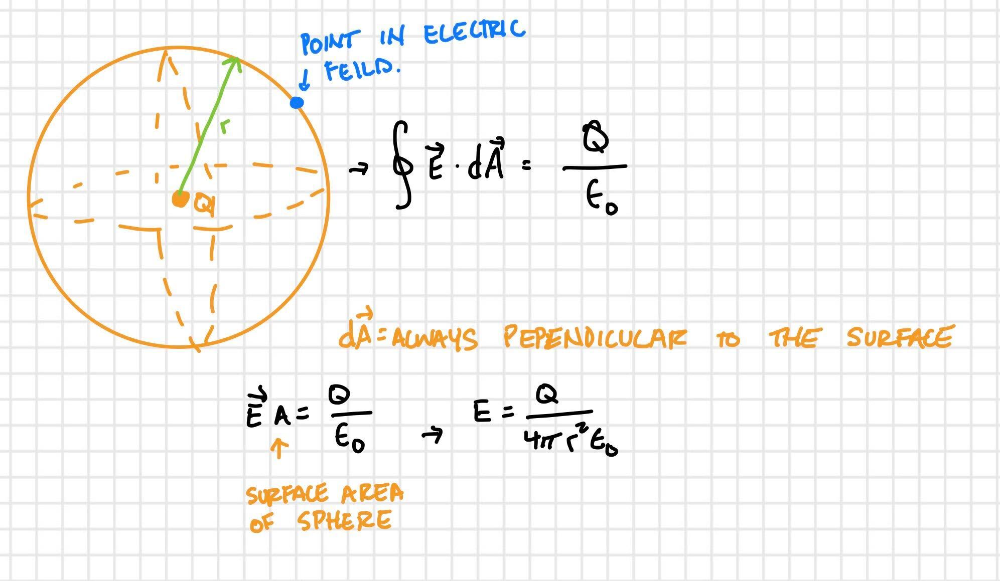
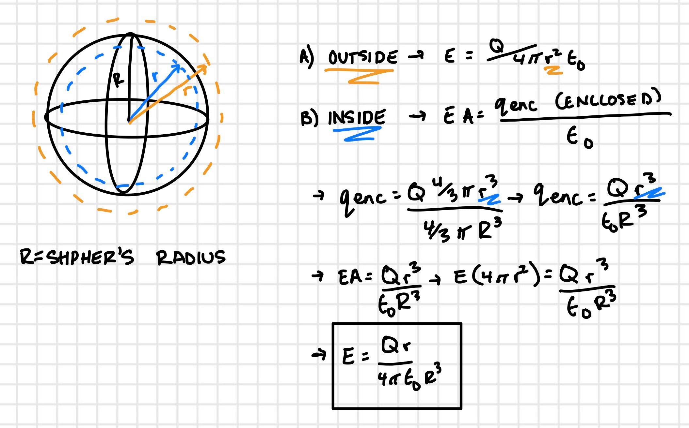
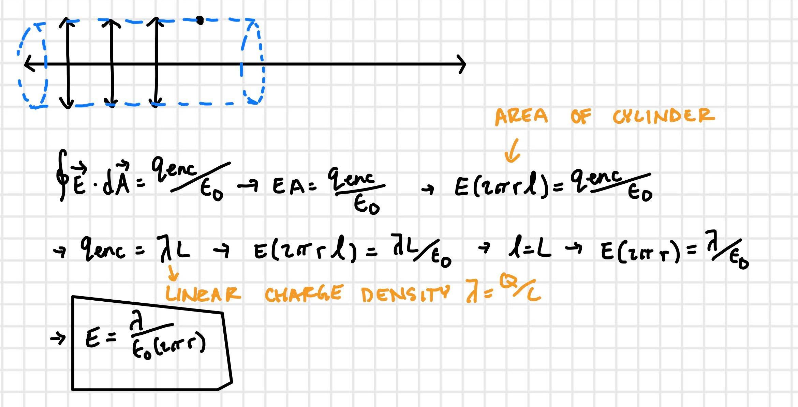
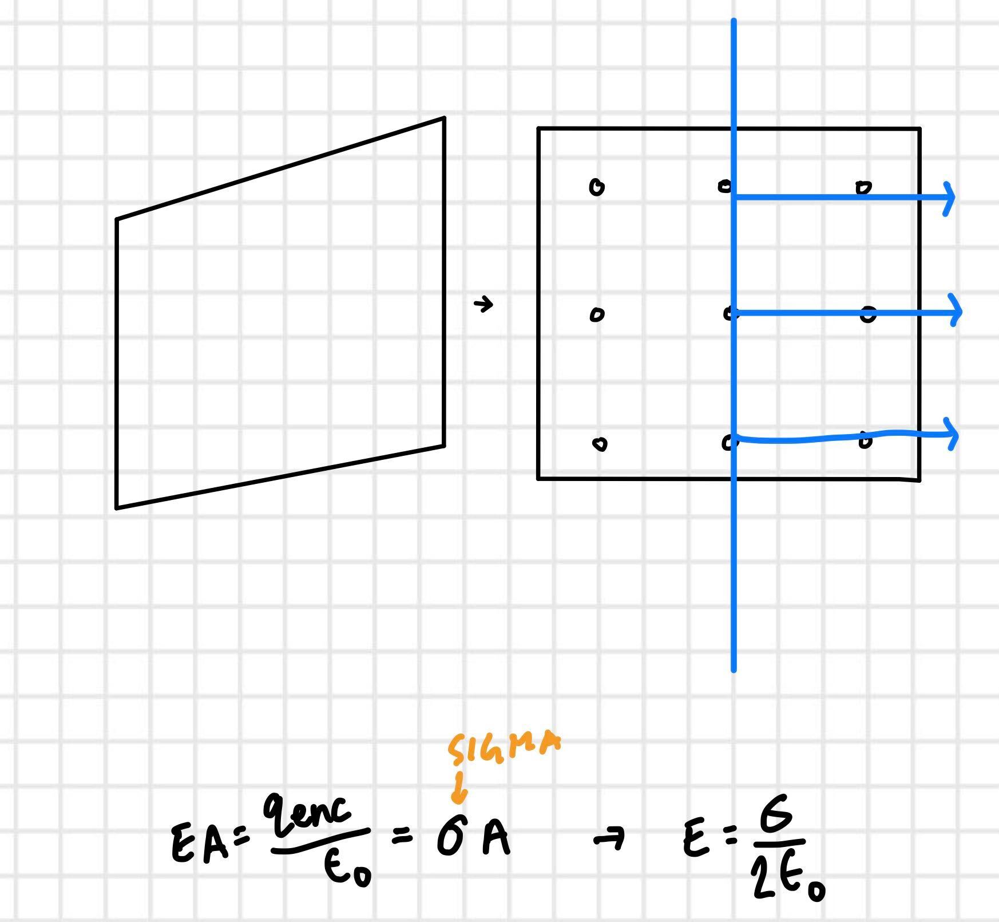
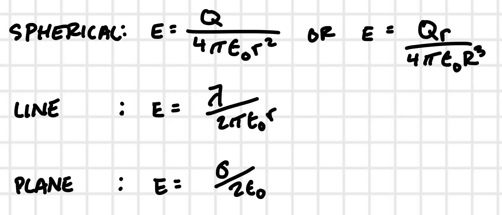

## September 9, 2020

---

### Gauss's Law

* The number of field lines emerging from a closed surface is proportional to the net charge enclosed.

* Alternatively, we may write: **The electric flux through any closed surface is proportional to the charge enclosed.**
  * The proportionality constant is 4(pi)k . Therefore:

  << Gauss's Law Equation here >>

* One of the four fundamental laws of electromagnetism
* It's true for any surface and charge anywhere in the universe
* Gauss's law is equivalent to Coulomb's law

#### Example:

A spherical surface surrounds an isolated positive charge. If a second charge is placed outside the surface, which of the following will be true of the total flux through the surface?

* It does not change
* It increases
* It decreases
* it increases or decreases depending on the sign of the second charge.

The answer is that it doesnt change.

However, for an electric field, it will change depending on if the external charge is positive, negative and how far away it is.

* Gauss's law is ALWAYS true, but it's useful for calculating the electric field only in situations with sufficient symmetry:
  * Spherical symmetry
  * Line symmetry
  * Plan symmetry

Situations where Gauss's law is helpful:

#### Spherical symmetry

#### Line Symmetry

#### Plane Symmetry

#### Summary:

#### Questions:

What is a Gaussian surface?

Q: Is flux part of the description for an electric field or is it different?

A: Flux represents how much electric field is flowing past the surface.

Magnitude of electric field is related to how many field lines there are.
