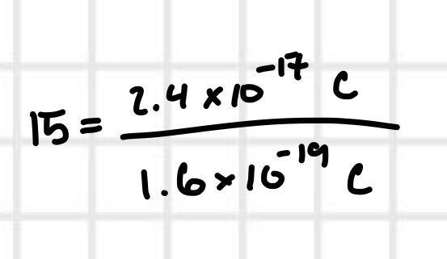
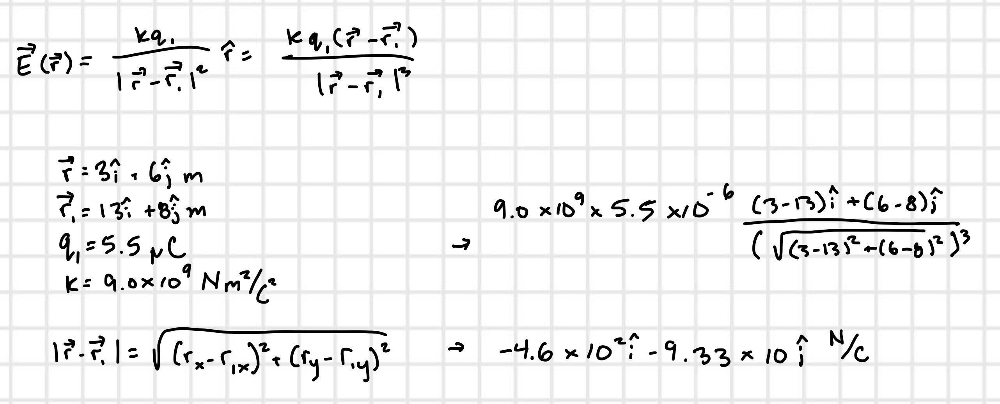
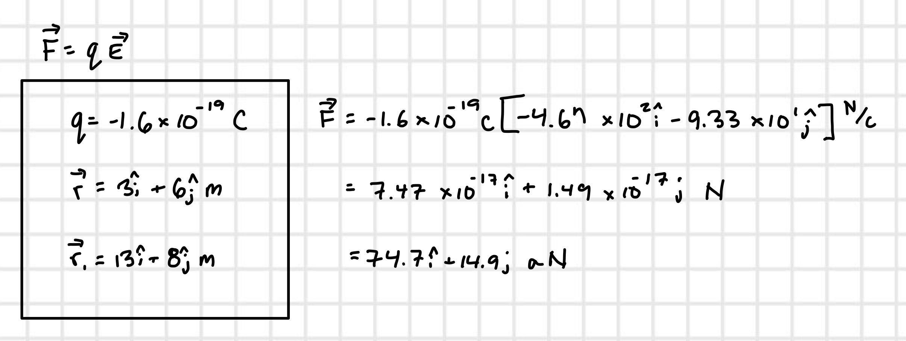

Q: A charged particle is located at the origin. Its electric field at any field point depends on the charge at that field point.

A: False

---

Q: An electric dipole requires two opposite electric charges.

A: True

Q: The number of protons that would be needed to make a net charge of 2.40 x 10-18 C is:     
* a) 150  
* ##### b) 15  
* c) 1.5
* d) 1

Proton has a positive charge of 1.6 x 10^-19 C

---

Q: The electric dipoles electric field is proportional to which power of distance:
 * a) 1/r
 * b) 1/r^2
 * c) ##### 1/r^3
 * d) 1/r^1.5

 ---

 Q: Calculate the electric field at field point 3i   +  6j   created by a 5.50  (greek symbol I dont know)C electric charge at 13i +  8j .

 ---

 Calculate the electric force on an electron at field point 3i   +  6j   and in the same electric field calculated for the prior problem. (Hint the force is a vector and has a magnitude and a direction)

 
