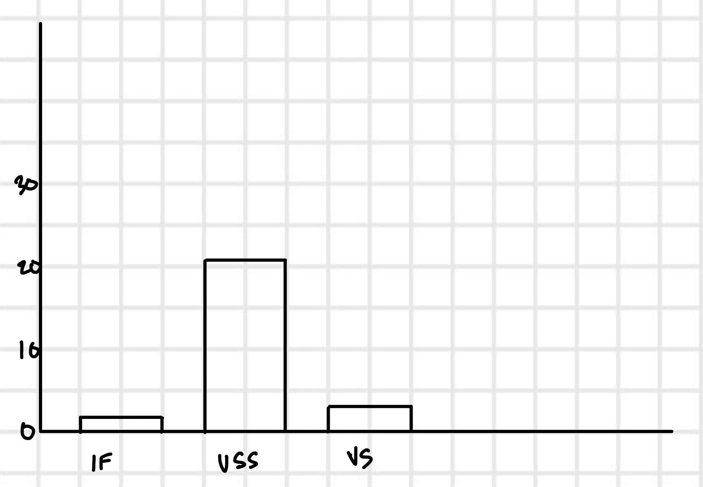
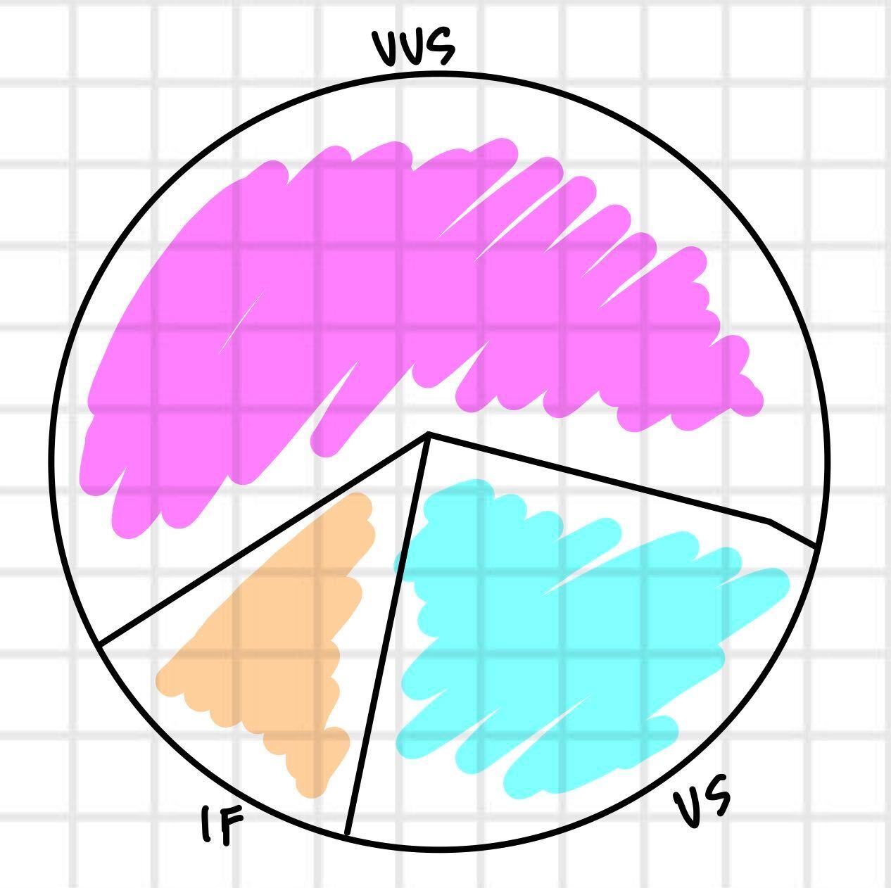
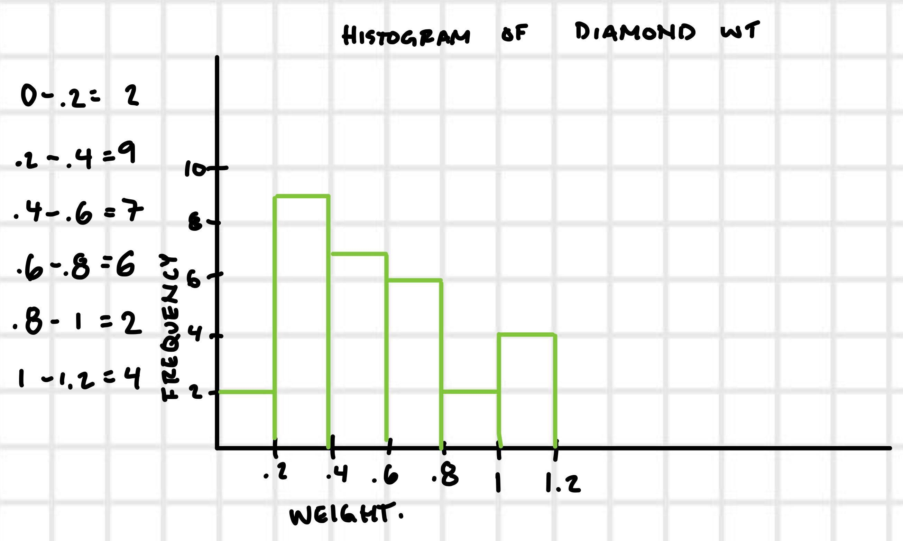

## September 8, 2020

---

### Announcements

Data:

Diamond clarity

|Clarity|Amount|
|--|--|
|IF|3|
|VVS|21|
|vs|6|

#### Bar Charts

##### Advantages

##### Disadvantages

#### Pie Charts

##### Advantages

##### Disadvantages
Often hard to read

#### Pictograph

##### Advantages
Can be more visually appealing

##### Disadvantages
Hard to interpret

### Summary for Quantitative (Numeric) data

### Graphical Summaries:
* Histograms
Boxplots
Scatterplots

#### Histograms

Definition: A graphic in which bar areas are proportional to corresponding percentages

NOT A BARCHART

Creating a histogram:

1) Divide the measurement axis into classes.

2) Determine the frequency and relative frequency for each class.

3) Over each interval, draw a rectangle whose height is the corresponding relative frequency

Width of an interval can be set to whatever you would like.

You typically want to use an interval that allows for catching trends. Not so short that you have too much information and not so long that the data is not informational.

Curved Histagraph

Tail: Extremes to the left and/or right

Peaks are referred to as Modes

Unimodal = One Peaks

Bimodal = Two Peaks

Multimodal = More than two

### Outliers

Observations that are apart from the majority of the data (outliers can create tails in a histogram)

#### Should you drop outliers?

If they are errors, YES!

If real data, NO!

### Mean

Found by adding up the numbers, and dividing by the number of observations

Average is often used in place in mean, but you should be aware that average has a more generic meaning. To be more precise, use the word 'mean'.

Mean is sensitive to extreme values.

### Median

Middle value when the values are sorted

Not sensitive to extreme values

### Mode
Value that occurs the most frequently.

Not sensitive to extreme values

### Range
Largest number - smallest number

### Deviation

Value - Mean

### Sample Variance

S^2 = i/(n-1) sum(Xi - Mean)^2

### Sample Standard Variance

S = sqrt(S^2)

S & S^2 are sensitive to extreme values.
