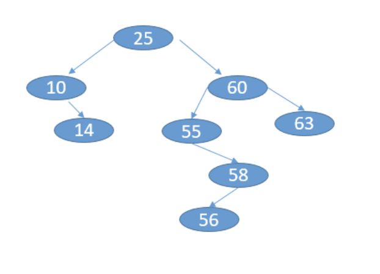

#### Assignment 2: Recursion

Due: Feb 3, 2020

Completed: No

---

#### Objective

The starter code contains the tests of each of the methods  you are to write.  Test them one at a time as you write them.  Feel free to modify prototypes any way you like, but include the same tests as shown.  All trees are trees of integers, so you don’t need to retain the generic feature of the code.  Some trees will be BST and some are not.  Make sure you don’t assume it is a BST unless specified.  You will notice in the starter code I have public helper functions which make it possible to call a routine without knowing the root, but have recursive “worker” routines that depend on knowing the current node.  The code  you write MUST BE your own work.  Do not copy from anywhere.

**Note**: In the comments to each function, provide a big-Oh expression for the complexity of the functions you write, assuming trees are roughly balanced (depth = log(n) for n nodes).    Use recursion where appropriate, but if something isn't logically recursive, don't use recursion.

Documentation of code and identifying the big-Oh are worth four points. Consult the style guidelines.

Build the trees as shown in the startr code.

##### Exercise 1: toString()
(2  points) Write a function, `toString()`, that returns a string containing: the tree name and the keys (in order) of a binary tree, given the root.  The parent of each node is indicated in square brackets.

Example:



Running toString() on the above tree would return the following:

```
Tree1:
63 [60]
60 [25]
58 [55]
56 [58]
55 [60]
25 [no parent]
14 [10]
10 [25]
```

#### Exercise 2: flip()

flip() to swap left and right children recursively.

Example:
