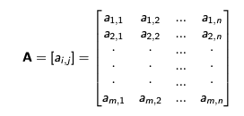
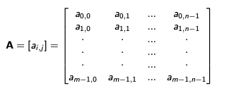
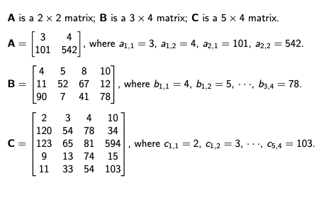
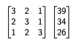
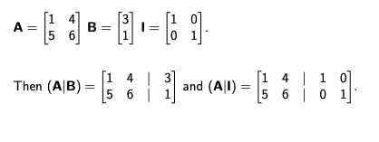
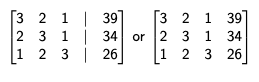
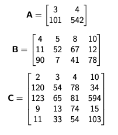

# Lecture 01: Linear Systems

---

## What is Scientific Computing?

Scientific Computing (SciComp) is the collection fo algorithms, tools, and theories required to solve numerical problems in various areas of science, engineering, mathematics, economics, etc. 

Most of these algorithms, tools, and theories originated in mathematics (calculus, linear algebra, number theory, etc) long before the advent of digital computers. These algorithms, tools, and theories used to be called (and are still called by some scientists today) Numerical Analysis. However, SciComp is a more common term today after digital computers have become mainstream and many methods of Numerical Analysis have been computerized. 

## Introduction

We start our journey of SciComp with linear systems. What is a linear system? For example: 

```
2x + y = 4
x - 2y = -3
```

We'll call any such collection of simultaneous linear equations a linear system. The above two equations are lines in 2D space, but we don't have to be bound by two dimentions, we have 3, 4, 5, or more dimensions. 

We'll be concerned with solving a linear systems of m equations in n unknowns. The aboe system has 2 equations in 2 unknowns. 

In mathematics (most notably in linear algebra) and in SciComp, linear systems are solved with matrices. As we'll see shortly, a matrix is a convenient notation for working with linear systems. 

The great pratical importance of using matrices to solve linear systems is that they enable us to solve linear systems by algebraic methods (i.e., by mechanical manipulation of symbols without using any geometry or computer graphics).

Linear systems are fundamental in linear programming, which we'll study later in this class, in finding approximate solutions to partial differential equations, computer vision, etc. 

The term matrix was introduced into mathematics literature in an 1850 paper by James Joseph Sylvester (1814-1897). Sylvester, rather obscurely, defined a matrix as an "oblong arrangement of terms."

## Definition and Notation

A *matrix* is a rectangular array of numbers. Matrices are typically denoted by uppercase boldface type ltters (e.g. A, B, E). An m x n matrix may be written as: 



The order/shape of the matrix refers to the number of rows and columns of the matrix. The symbol a_ij refers to the entry in row i and column j. 

We can use 0-based counting to refer to the rows and columns of a matrix. If we use --based notation, then an m x n matrix A can be defined as follows. Now that the very first entry in the top left corner is now a_0,0, not a_1,1



Sometimes the commas are omited in the subscripts of individual elements. (i.e. a_11 vs a_1,1)

Examples: 



## Matrix as Shorthand Notation for Linear System

Let's consider this linear system: 

```
3x + 2y + z = 39
2x + 3y + z = 34
x + 2y + 3z = 26
```

This linear system can be represented in two matrices



The left matrix containst he variable coefficients; The right matrix (that's the column matrix or column vector, by the way) contains the right hand side values of each equation. These two matrices preserve all essential information about the linear system, except the variable names (but those are not important). Let's see hwo we put these two matrices into one matrix with augmented matrices. 

## Augmented Matrix

An augmented matrix is a matrix in which rows or columns of another matrix of the appropriate order are appended to the original matrix (typically, to the right of the original matrix). If A is agumented on the right with B, the resultant matrix is denoted as (A|B) or [A|B]. 



## Matrix as Shorthand Notation for Linear System

Using the previous linear system of equations: 

```
3x + 2y + z = 39
2x + 3y + z = 34
x + 2y + 3z = 26
```
Instead of being represented by two matrices, it can be represented as an augmented matrix: 



## Matrices in Numpy

Let's define three matrices and construct them with a Python library called 'numpy'. 

A is a 2 x 2 matrix; B is a 3 x 4 matrix; C is a 5 x 4 matrix. 



```Python
import numpy as np

A = np.array([[7, -1, -2],
              [3, 3, 0]])

>>> A
array([[ 7, -1, -2],
       [ 3, 3, 0]])
>>> A[1,1] == A[1][1] == 3
True
>>> A[0,1] == A[0][1] == -1
True
>>> A[1,2] == A[1][2] == 0
True
```

## Matrix Addition in Numpy

